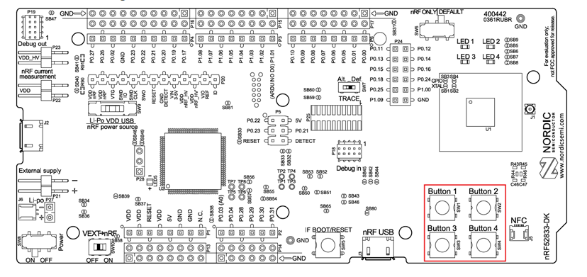
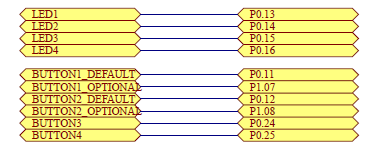

# nRF52840 LED Button Polling

This project demonstrates how to control multiple LEDs using buttons on the nRF52840 Development Kit (DK). The example is implemented using the Zephyr RTOS, leveraging the DeviceTree for hardware abstraction. The buttons' states are polled, and the LEDs are updated accordingly.

---

## **Prerequisites**

- **Hardware**: Nordic Semiconductor nRF52840 DK
- **Software**: 
  - Zephyr SDK
  - Nordic Semiconductor nRF Connect SDK
- A basic understanding of GPIO operations and Zephyr's DeviceTree.

---

## **Features**

- Reads input from three buttons on the nRF52840 DK:
  - **Button 1**: Directly controls **LED 1**, turning it on while pressed and off when released.
  - **Button 2**: Toggles blinking of **LED 2**.
  - **Button 3**: Cycles **LED 3** through three patterns: off, on, and blinking.
- Implements a polling mechanism with a configurable sleep interval for power efficiency.
- Modular code structure with separate files for buttons and LEDs.

---

## **Hardware Setup**

### **Button and LED Mapping**
The code uses the following mappings:
- **Button 1** (`sw0`): Controls **LED 1** (`led0`).
- **Button 2** (`sw1`): Toggles blinking for **LED 2** (`led1`).
- **Button 3** (`sw2`): Cycles patterns for **LED 3** (`led2`).

### **Buttons Locations**


### **Button Pin Mapping**


---

## **How to Run**

1. **Set Up the Environment**:
   - Install Zephyr and nRF Connect SDK.
   - Clone the repository.

2. **Build the Application**:
   - Navigate to the project directory and use west to build:
     ```bash
     west build -b nrf52840dk_nrf52840
     ```

3. **Flash the Firmware**:
   - Connect the nRF52840 DK and flash the firmware:
     ```bash
     west flash
     ```

4. **Test the Application**:
   - **Button 1**: Press and hold to turn **LED 1** on. Release to turn it off.
   - **Button 2**: Press to toggle blinking for **LED 2**.
   - **Button 3**: Press to cycle **LED 3** through off, on, and blinking modes.

---

## **Code Structure**

### **Main Application (`main.c`)**
Handles the polling loop, button state reading, and LED updates based on the button logic.

### **Buttons Module (`buttons.c` and `buttons.h`)**
- Initializes button GPIOs.
- Reads the state of individual buttons.

### **LEDs Module (`leds.c` and `leds.h`)**
- Initializes LED GPIOs.
- Provides functions to set LED state or toggle LEDs.

## 🔗 Quick Links

- [📁 Back to Nordic-Semiconductor Projects](https://github.com/Amid68/Amid68/blob/main/projects/embedded_projects.md#nordic-semiconductor-nrf52840)
